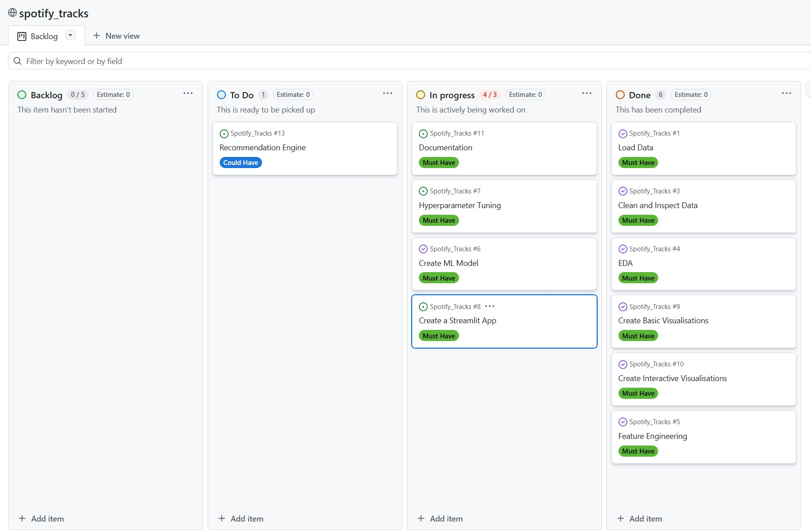

# 

# Spotify Tracks Recommendation Engine!

## Project Bookmarks:

-   [README](https://github.com/ali-khurshid/Spotify_Tracks/blob/main/README.md)
-   [Project board](https://github.com/users/ali-khurshid/projects/8)
-   [Data](https://github.com/ali-khurshid/Spotify_Tracks/tree/main/data)
-   [Data Cleaning Jupyter Notebook](https://github.com/ali-khurshid/Spotify_Tracks/blob/main/notebooks/01_data_cleaning.ipynb)
-   [Feature engineering Jupyter Notebook](https://github.com/ali-khurshid/Spotify_Tracks/blob/main/notebooks/03_feature_engineering.ipynb)
-   [Hypothesis 1 Features vs popularity](https://github.com/ali-khurshid/Spotify_Tracks/blob/main/notebooks/04_H1_features_vs_popularity.ipynb)
-   [Hypothesis 2 Explicit vs Non-explicit Tracks](https://github.com/ali-khurshid/Spotify_Tracks/blob/main/notebooks/05_H2_explicit_vs_nonexplicity.ipynb)
-   [Hypothesis 3 Acousticness vs Energy and popularity](https://github.com/ali-khurshid/Spotify_Tracks/blob/main/notebooks/06_H3_acousticness_vs_energy_and_popularity.ipynb)
-   [Streamlit]()
-   [Conclusion and Discussion](#conclusion-and-discussion)

## Table of Contents:

-   [Project Overview](#project-overview)
-   [Dataset Content](#dataset-content)
-   [Business Requirements](#business-requirements)
-   [Hypothesis Testing and Validation](#hypothesis-testing-and-validation)
-   [Rationale to map business requirements](#the-rationale-to-map-the-business-requirements-to-the-data-visualisations)
-   [Analysis Techniques Used](#analysis-techniques-used)
-   [Project Plan](#project-plan)
-   [Project Board](#project-board)
-   [Ethical Consideration](#ethical-considerations)
-   [Streamlit App](#streamlit-app)
-   [Unfixed Bugs and Challenges Faced](#unfixed-bugs-and-challenges-faced)
-   [Development Roadmap](#development-roadmap)
-   [Main data Analysis Libraries](#main-data-analysis-libraries)
-   [Findings](#findings)
-   [Conclusion and Discussion](#conclusion-and-discussion)
-   [Credits](#credits)
-   [Acknowledgements](#acknowledgements)

## Project Overview

This project analyzes a dataset of Spotify tracks, including audio features, artist information, and song popularity. Through exploratory data analysis (EDA), it explores distributions and relationships between features, uncovering patterns that influence track popularity.

The project also performs correlation analysis to examine how attributes like danceability, energy, and tempo relate to popularity, and applies clustering techniques to group tracks with similar audio characteristics. These insights can inform playlist curation and music recommendation strategies.

---

## Dataset Content

The [Spotify Track Records](https://www.kaggle.com/datasets/maharshipandya/-spotify-tracks-dataset/data) downloaded from kaggle contains dataset of Spotify songs with different genres and their audio features.
The dataset columns can be split into two categories metadata and audio features:

-   **Metadata:**

    -   `track_id` - The Spotify ID for the track
    -   `artists` - the name(s) of the performer(s)
    -   `album_name` The album name in which the track appears
    -   `track_name` - the name of the track
    -   `popularity` - a rating from 0 to 100 which indicates trak popularity
    -   `duration_ms` - song length in milliseconds
    -   `explicit` - boolean representing whether the track has explicit lyrics
    -   `genre` - song category from spotify (e.g. pop)

-   **Audio Features:**

    -   `danceability` - Danceability describes how suitable a track is for dancing
    -   `energy` - Energy is a measure from 0.0 to 1.0 and represents a perceptual measure of intensity and activity
    -   `key` - The key the track is in
    -   `loudness` - The overall loudness of a track in decibels (dB)
    -   `mode` - major or minor
    -   `speechiness` - Speechiness detects the presence of spoken words in a track.
    -   `acousticness` - A measure from 0.0 to 1.0 of whether the track is acoustic
    -   `instrumentalness` - Predicts whether a track contains no vocals.
    -   `liveness` - Detects the presence of an audience in the recording
    -   `valence` - A measure from 0.0 to 1.0 describing the musical positiveness
    -   `tempo` - The overall estimated tempo of a track in beats per minute (BPM)
    -   `time_signature` - An estimated time signature

---

## Business Requirements

-   Predict the popularity of a song based on its audio features. Which features in songs (e.g. dancability or energy) lead to songs being more popular. Can we predict what songs will get lots of streams and make lots of money
-   Set up the infrastructure to make a recommendation engine. Can similar songs be categorised based on their audio features and so could we use this to recommend songs to users based on their listening history.

---

## Hypothesis Testing and Validation

**Hypothesis 1:** Tracks with higher danceability and energy have significantly higher popularity scores than tracks with lower values.

-   Correlation analysis to see if there is a correlation between dancability and popularity

**Hypothesis 2:** Explicit tracks are, on average, more popular than non-explicit tracks.

-   Correlation analysis between explicit tracks (those that contain explicit language) and popularity to see if there is a correation between the explicit nature of the song and popularity.

**Hypothesis 3:** Tracks with high acousticness have lower energy and lower popularity.

-   Calculate the correlation between acousticness and energy and acousticness and popularity

**Hypothesis 4:** Tracks cluster into distinct musical profiles that differ significantly in popularity.

-   Perform an unsupervised clustering task on the audio features to group track into distinct groups.
-   Use a statistical test (depending on normality) to see if the popularity of the different clusters differs significantly.

## The rationale to map the business requirements to the data visualisations

| Analysis Step                      | Visualization                                                         | Purpose / Insight                                                                                                |
| ---------------------------------- | --------------------------------------------------------------------- | ---------------------------------------------------------------------------------------------------------------- |
| **Feature Exploration**            | Histograms / Boxplots of audio features                               | Understand distributions, ranges, and detect outliers in key features like energy, danceability, tempo, loudness |
| **Categorical Feature Comparison** | Bar charts / Count plots (Explicit vs Non-explicit, Key distribution) | Compare counts across categories to understand feature prevalence and patterns                                   |
| **Feature Relationships**          | Scatter plots (Danceability vs Popularity, Energy vs Popularity)      | Identify relationships between audio features and track popularity; visually assess correlations                 |
| **Correlation Analysis**           | Correlation heatmap                                                   | Show which numerical features are strongly correlated; guide further analysis and feature selection              |
| **Clustering Validation**          | Elbow plot & Silhouette scores                                        | Evaluate different k values to select the most appropriate number of clusters for grouping tracks                |
| **Cluster Formation**              | Clustering plots (scatter with clusters / PCA)                        | Visualize clusters of tracks based on audio features; understand how tracks group together                       |
| **Cluster Popularity Analysis**    | Boxplots & Violin plots of Popularity by Cluster                      | Compare popularity distributions across clusters; identify clusters with higher listener engagement              |
| **Cluster Feature Profiles**       | Radar / Spider plots of audio features by cluster                     | Highlight characteristic audio feature patterns of each cluster; identify unique cluster signatures              |
| **Track Recommendations**          | Recommendation table (based on radar plot clusters)                   | Suggest tracks similar to a given profile; enable playlist curation and personalized recommendations             |

## Project Plan

| Day       |                                Plan                                 |                                              Responsibility                                               |
| :-------- | :-----------------------------------------------------------------: | :-------------------------------------------------------------------------------------------------------: |
| Tuesday   | Load data, clean, hypothesis creation, EDA, and feature engineering | Perform EDA and understand relationships. Generate 4 hypotheses including an unsupervised clustering task |
| Wednesday |       Classification model creation and hyperparameter tuning       |                    Cluster creation, visualisation and data preparation for the model                     |
| Thursday  |                     Dashboard and documentation                     |                      Make an engaging streamlit dashboard and update readme sections                      |
| Friday    |                            Presentation                             |                                               Presentation                                                |

## Project Board

Our project board on Day 2 of the hackathon.

## Ethical Considerations

-   **Data anonymization –** No personally identifiable information is used.

- **Fairness and bias –** The model and analyses do not discriminate against any genre, artist, or demographic. Any clustering or recommendations are based purely on audio features and popularity metrics.

- **Transparency –** All datasets, methods, and algorithms are clearly documented, and code is shared for reproducibility.

- **Responsible recommendations –** Suggested tracks are intended for exploration and playlist curation; the system does not influence user behavior beyond general recommendations.

- **Data source acknowledgement –** The dataset is publicly available on Kaggle and used in compliance with its terms of use.

---

## Streamlit App

We created a **Streamlit app** to allow interactive exploration and analysis of Spotify tracks.

The app is a **multi-page dashboard** consisting of:

- **Homepage** – Introduction to the dataset, project goals, and key features.

- **EDA (Exploratory Data Analysis)** – Visualizations of feature distributions, correlations, and relationships with popularity.

- **Analysis ➡️ Hypothesis Testing** – Statistical analysis to test relationships between track features and popularity.

- **Clustering** – Clustering tracks based on audio features with PCA and cluster visualizations. This also includes personalized track recommendations based on cluster profiles and audio features.

---

## Unfixed Bugs

No unfixed bugs to report.

## Development Roadmap

<u>**Challenges Faced**</u>

<u>**What Next**</u>

---

## Main Data Analysis Libraries

The following libraries were used in my project.

-   `helpers`
-   `joblib`
-   `matplotlib` . `pyplot`
-   `numpy`
-   `os`
-   `Pandas`
-   `pyexpat`
-   `scipy` . `stats`
-   `seaborn`
-   `sklearn` . `pipeline`
-   `sklearn` . `compose`
-   `sklearn` . `preprocessing`
-   `sklearn` . `impute`
-   `sklearn` . `linear_model`
-   `sklearn` . `metrics`
-   `imblearn` . `oversampling`
-   `sklearn` . `model_selection`
-   `sklearn` . `ensemble`
-   `streamlit`

---

## Findings

## Conclusion and Discussion

## Credits

### Content

-   ChatGPT helped me rephrase my englih and sentence construction in this document.
-   ChatGPT was used to help create code and debug errors. It alsohelped unblock deployment of my Streamlit app to the cloud, which took several hours to complete.
-   Dataset downloaded from [Kaggle](https://www.kaggle.com/datasets).

### Media

-   Streamlit banner image taken from [Freepik](https://www.freepik.com/)

## Acknowledgements

-   Special thanks to our facilitator Emma Lamont, Our Tutors Neil, Michael, Mark and Spencer for making this course easy to learn.
-   I'd like to thank all my colleagues for being a fun group to work with.

